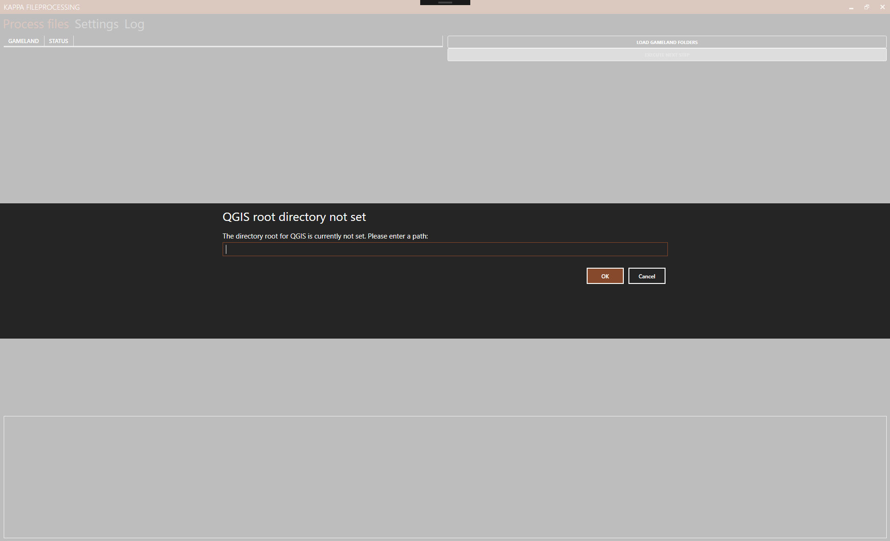
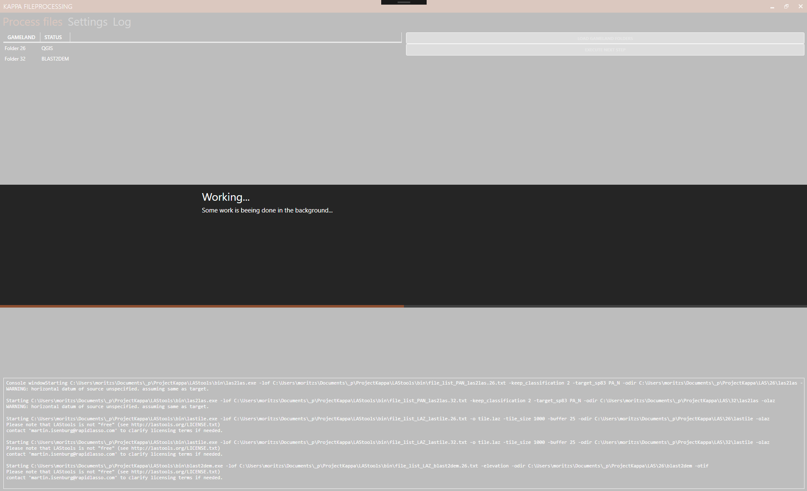

# ProjectKappa

A tool to automate processing *.las* files


**Description of program flow:**

---

1. las2las: create a tree of all directories containing .las files starting from a defined root directory
   *for each directory, refered to in the following by ``{dirnr}``*
   1. compile a list of *PAN.las files to convert to .laz
      1. command will be in the following format:  ```“las2las -lof file_list.{dirnr}.txt -keep_classification 2 -target_sp83 PA_N -odir "E:\Pennsylvania Iron and Charcoal\LAS Files\{dirnr}\las2las" -olaz”```
      2. compile a list of *PAS.las files to convert to .laz
         1. command will be in the following format:  ``“las2las -lof file_list.{dirnr}.txt -keep_classification 2 -target_sp83 PA_S -odir "E:\Pennsylvania Iron and Charcoal\LAS Files\{dirnr}\las2las" -olaz”``

*note: every directory (e.g. 26) will further contain a las2las sub-directory in which the desired output in the .laz format will be created*

---

2. lastile: create a tree of all directories containing .laz files starting from a defined root directory 
   *for each directory, refered to in the following by ``{dirnr}``*
   1. compile a list of *.laz files to convert to tile_*.laz files 
      1. command will be in the following format: ``“lastile -lof file_list.{dirnr}.txt -o "tile.laz" -tile_size 1000 -buffer 25 -odir "E:\Pennsylvania Iron and Charcoal\LAS Files\{dirnr}\lastile" -olaz”``

*note: every directory (e.g. 26) will further contain a lastile sub-directory in which the desired output in the .laz format will be created*

---

3. BLAST2DEM: create a tree of all directories containing tile_*.laz files starting from a defined root directory
   *for each directory, refered to in the following by ``{dirnr}``*
   1. compile a list of *.laz files to convert to *.tif, *.kml, and *.tfw
      1. command will be in the following format: ``“blast2dem -lof file_list.{dirnr}.txt -elevation -odir "E:\Pennsylvania Iron and Charcoal\LAS Files\{dirnr}\blast2dem" -otif”``

*note: every directory (e.g. 26) will further contain a blast2dem sub-directory in which the desired output will be created*

---


# Before / After

## Before

```
C:\USERS\USER\DOCUMENTS\_P\PROJECTKAPPA\LAS
+---26
¦       36002290PAN.las
¦       37002300PAN.las
¦
+---32
        37002300PAN.las
```

## After

```
C:\USERS\USER\DOCUMENTS\_P\PROJECTKAPPA\LAS
+---26
¦   ¦   36002290PAN.las
¦   ¦   37002300PAN.las
¦   ¦
¦   +---blast2dem
¦   ¦       tile_697000_106000.kml
¦   ¦       tile_697000_106000.tfw
¦   ¦       tile_697000_106000.tif
¦   ¦       tile_697000_107000.kml
¦   ¦       tile_697000_107000.tfw
¦   ¦       tile_697000_107000.tif
¦   ¦       tile_697000_108000.kml
¦   ¦       tile_697000_108000.tfw
¦   ¦       tile_697000_108000.tif
¦   ¦       tile_697000_109000.kml
¦   ¦       tile_697000_109000.tfw
¦   ¦       tile_697000_109000.tif
¦   ¦       tile_698000_106000.kml
¦   ¦       tile_698000_106000.tfw
¦   ¦       tile_698000_106000.tif
¦   ¦       tile_698000_107000.kml
¦   ¦       tile_698000_107000.tfw
¦   ¦       tile_698000_107000.tif
¦   ¦       tile_698000_108000.kml
¦   ¦       tile_698000_108000.tfw
¦   ¦       tile_698000_108000.tif
¦   ¦       tile_698000_109000.kml
¦   ¦       tile_698000_109000.tfw
¦   ¦       tile_698000_109000.tif
¦   ¦       tile_699000_106000.kml
¦   ¦       tile_699000_106000.tfw
¦   ¦       tile_699000_106000.tif
¦   ¦       tile_699000_107000.kml
¦   ¦       tile_699000_107000.tfw
¦   ¦       tile_699000_107000.tif
¦   ¦       tile_699000_108000.kml
¦   ¦       tile_699000_108000.tfw
¦   ¦       tile_699000_108000.tif
¦   ¦       tile_699000_109000.kml
¦   ¦       tile_699000_109000.tfw
¦   ¦       tile_699000_109000.tif
¦   ¦       tile_700000_106000.kml
¦   ¦       tile_700000_106000.tfw
¦   ¦       tile_700000_106000.tif
¦   ¦       tile_700000_107000.kml
¦   ¦       tile_700000_107000.tfw
¦   ¦       tile_700000_107000.tif
¦   ¦       tile_700000_108000.kml
¦   ¦       tile_700000_108000.tfw
¦   ¦       tile_700000_108000.tif
¦   ¦       tile_700000_109000.kml
¦   ¦       tile_700000_109000.tfw
¦   ¦       tile_700000_109000.tif
¦   ¦       tile_701000_106000.kml
¦   ¦       tile_701000_106000.tfw
¦   ¦       tile_701000_106000.tif
¦   ¦       tile_701000_107000.kml
¦   ¦       tile_701000_107000.tfw
¦   ¦       tile_701000_107000.tif
¦   ¦       tile_701000_108000.kml
¦   ¦       tile_701000_108000.tfw
¦   ¦       tile_701000_108000.tif
¦   ¦       tile_701000_109000.kml
¦   ¦       tile_701000_109000.tfw
¦   ¦       tile_701000_109000.tif
¦   ¦       tile_701000_110000.kml
¦   ¦       tile_701000_110000.tfw
¦   ¦       tile_701000_110000.tif
¦   ¦       tile_701000_111000.kml
¦   ¦       tile_701000_111000.tfw
¦   ¦       tile_701000_111000.tif
¦   ¦       tile_701000_112000.kml
¦   ¦       tile_701000_112000.tfw
¦   ¦       tile_701000_112000.tif
¦   ¦       tile_702000_109000.kml
¦   ¦       tile_702000_109000.tfw
¦   ¦       tile_702000_109000.tif
¦   ¦       tile_702000_110000.kml
¦   ¦       tile_702000_110000.tfw
¦   ¦       tile_702000_110000.tif
¦   ¦       tile_702000_111000.kml
¦   ¦       tile_702000_111000.tfw
¦   ¦       tile_702000_111000.tif
¦   ¦       tile_702000_112000.kml
¦   ¦       tile_702000_112000.tfw
¦   ¦       tile_702000_112000.tif
¦   ¦       tile_703000_109000.kml
¦   ¦       tile_703000_109000.tfw
¦   ¦       tile_703000_109000.tif
¦   ¦       tile_703000_110000.kml
¦   ¦       tile_703000_110000.tfw
¦   ¦       tile_703000_110000.tif
¦   ¦       tile_703000_111000.kml
¦   ¦       tile_703000_111000.tfw
¦   ¦       tile_703000_111000.tif
¦   ¦       tile_703000_112000.kml
¦   ¦       tile_703000_112000.tfw
¦   ¦       tile_703000_112000.tif
¦   ¦       tile_704000_109000.kml
¦   ¦       tile_704000_109000.tfw
¦   ¦       tile_704000_109000.tif
¦   ¦       tile_704000_110000.kml
¦   ¦       tile_704000_110000.tfw
¦   ¦       tile_704000_110000.tif
¦   ¦       tile_704000_111000.kml
¦   ¦       tile_704000_111000.tfw
¦   ¦       tile_704000_111000.tif
¦   ¦       tile_704000_112000.kml
¦   ¦       tile_704000_112000.tfw
¦   ¦       tile_704000_112000.tif
¦   ¦
¦   +---las2las
¦   ¦       36002290PAN.laz
¦   ¦       37002300PAN.laz
¦   ¦
¦   +---lastile
¦   ¦       tile_697000_106000.laz
¦   ¦       tile_697000_107000.laz
¦   ¦       tile_697000_108000.laz
¦   ¦       tile_697000_109000.laz
¦   ¦       tile_698000_106000.laz
¦   ¦       tile_698000_107000.laz
¦   ¦       tile_698000_108000.laz
¦   ¦       tile_698000_109000.laz
¦   ¦       tile_699000_106000.laz
¦   ¦       tile_699000_107000.laz
¦   ¦       tile_699000_108000.laz
¦   ¦       tile_699000_109000.laz
¦   ¦       tile_700000_106000.laz
¦   ¦       tile_700000_107000.laz
¦   ¦       tile_700000_108000.laz
¦   ¦       tile_700000_109000.laz
¦   ¦       tile_701000_106000.laz
¦   ¦       tile_701000_107000.laz
¦   ¦       tile_701000_108000.laz
¦   ¦       tile_701000_109000.laz
¦   ¦       tile_701000_110000.laz
¦   ¦       tile_701000_111000.laz
¦   ¦       tile_701000_112000.laz
¦   ¦       tile_702000_109000.laz
¦   ¦       tile_702000_110000.laz
¦   ¦       tile_702000_111000.laz
¦   ¦       tile_702000_112000.laz
¦   ¦       tile_703000_109000.laz
¦   ¦       tile_703000_110000.laz
¦   ¦       tile_703000_111000.laz
¦   ¦       tile_703000_112000.laz
¦   ¦       tile_704000_109000.laz
¦   ¦       tile_704000_110000.laz
¦   ¦       tile_704000_111000.laz
¦   ¦       tile_704000_112000.laz
¦   ¦
¦   +---QGISDEM
¦           26_DEM.tif
¦
+---32
    ¦   37002300PAN.las
    ¦
    +---blast2dem
    ¦       tile_701000_109000.kml
    ¦       tile_701000_109000.tfw
    ¦       tile_701000_109000.tif
    ¦       tile_701000_110000.kml
    ¦       tile_701000_110000.tfw
    ¦       tile_701000_110000.tif
    ¦       tile_701000_111000.kml
    ¦       tile_701000_111000.tfw
    ¦       tile_701000_111000.tif
    ¦       tile_701000_112000.kml
    ¦       tile_701000_112000.tfw
    ¦       tile_701000_112000.tif
    ¦       tile_702000_109000.kml
    ¦       tile_702000_109000.tfw
    ¦       tile_702000_109000.tif
    ¦       tile_702000_110000.kml
    ¦       tile_702000_110000.tfw
    ¦       tile_702000_110000.tif
    ¦       tile_702000_111000.kml
    ¦       tile_702000_111000.tfw
    ¦       tile_702000_111000.tif
    ¦       tile_702000_112000.kml
    ¦       tile_702000_112000.tfw
    ¦       tile_702000_112000.tif
    ¦       tile_703000_109000.kml
    ¦       tile_703000_109000.tfw
    ¦       tile_703000_109000.tif
    ¦       tile_703000_110000.kml
    ¦       tile_703000_110000.tfw
    ¦       tile_703000_110000.tif
    ¦       tile_703000_111000.kml
    ¦       tile_703000_111000.tfw
    ¦       tile_703000_111000.tif
    ¦       tile_703000_112000.kml
    ¦       tile_703000_112000.tfw
    ¦       tile_703000_112000.tif
    ¦       tile_704000_109000.kml
    ¦       tile_704000_109000.tfw
    ¦       tile_704000_109000.tif
    ¦       tile_704000_110000.kml
    ¦       tile_704000_110000.tfw
    ¦       tile_704000_110000.tif
    ¦       tile_704000_111000.kml
    ¦       tile_704000_111000.tfw
    ¦       tile_704000_111000.tif
    ¦       tile_704000_112000.kml
    ¦       tile_704000_112000.tfw
    ¦       tile_704000_112000.tif
    ¦
    +---las2las
    ¦       37002300PAN.laz
    ¦
    +---lastile
    ¦       tile_701000_109000.laz
    ¦       tile_701000_110000.laz
    ¦       tile_701000_111000.laz
    ¦       tile_701000_112000.laz
    ¦       tile_702000_109000.laz
    ¦       tile_702000_110000.laz
    ¦       tile_702000_111000.laz
    ¦       tile_702000_112000.laz
    ¦       tile_703000_109000.laz
    ¦       tile_703000_110000.laz
    ¦       tile_703000_111000.laz
    ¦       tile_703000_112000.laz
    ¦       tile_704000_109000.laz
    ¦       tile_704000_110000.laz
    ¦       tile_704000_111000.laz
    ¦       tile_704000_112000.laz
    ¦
    +---QGISDEM
            32_DEM.tif
```


# Screens

## Prompt for missing setting




## During work

